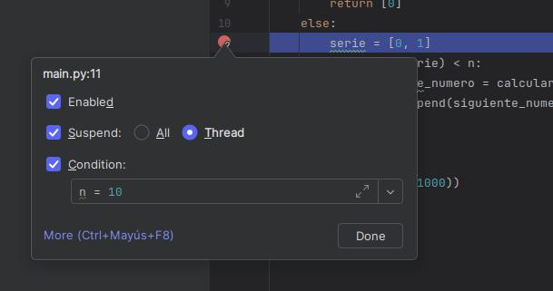

1 Si la función es llamada con n=10, ¿cuál es el valor de la variable n 
que se visualiza en la ventana de variables del debugger justo antes de que se 
ejecute la línea serie = [0, 1]?

Colocamos el breakpoint en la linea que dice el enunciado y con clic derecho asignamos la variable n=10

 
Luego ejecutamos el debug dandole al boton de el bicho arriba a la derecha y saldra el valor de la variable(en este caso n = 1000)
